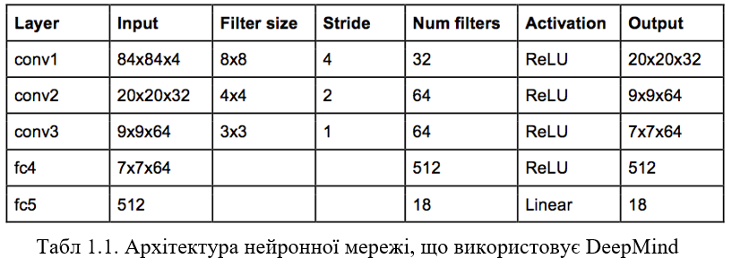
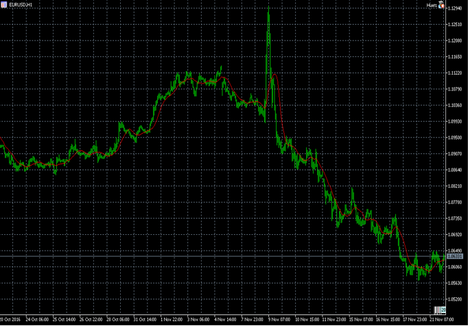
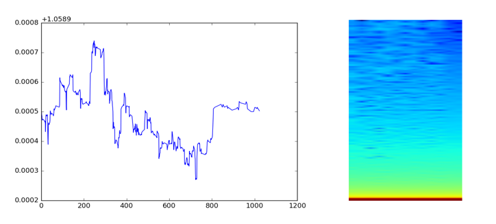

# iasa-Coursework_Trader
My coursework on the third year of Bachelor's studies. 

## Task:

The idea was to use this project as a foundation: https://github.com/yanpanlau/Keras-FlappyBird
And then try to learn a Neural Network architecture used by DeepMind to trade Forex.

I was not keen at NN at that time, so the project wasn't a success.
Basically, I wrote a game that was outputting a spectrogram using Fourier transformating for every new frame.
I've also added a line of pixels, indicating the cuttent situation on the marketpace.
Only three states were possible:
- short position
- no positions open
- long position

The NN was allowed to do two actions on every new frame:
- buy
- sell
- do nothing

If the position was "short" and the NN decided to "buy", position switched to "no positions open".
This allowed to keep the program simple.

Unfortunately, the part with generating spectrograms is now available, as was developed by my peers. 
Though, it's code and description is available in the Coursework file.

Year - 2017
